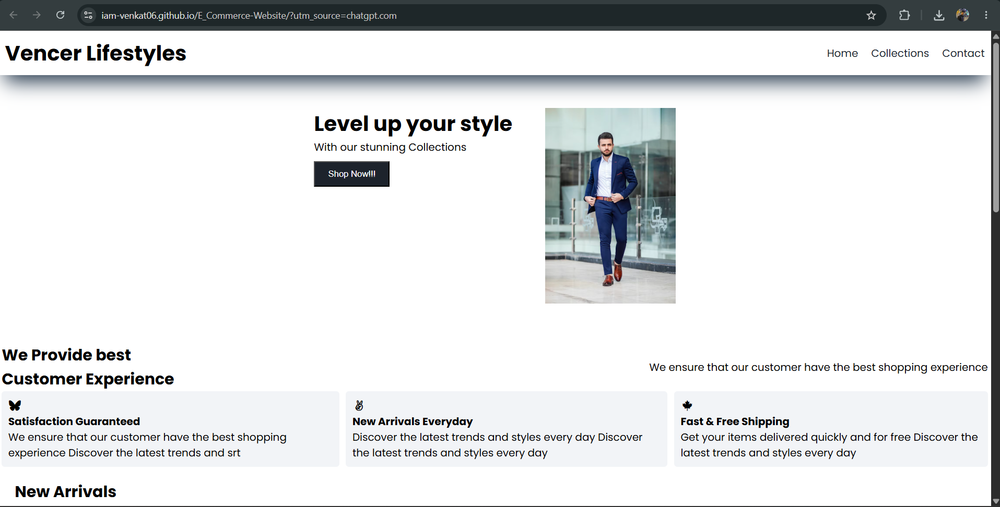

# 🛒 E-Commerce Website

A responsive and user-friendly E-Commerce website built using **HTML, CSS, and JavaScript**. This project showcases a modern shopping interface with an attractive UI and interactive features.

# 🛒 E-Commerce Website



## 🚀 Live Demo

🔗 https://iam-venkat06.github.io/E_Commerce-Website/

## 📌 Features

- 🏠 Responsive Home Page
- 🛍️ Product Collection Page
- 🆕 New Arrivals Section
- 📞 Contact Page
- 🎨 Modern and Responsive UI
- ⚡ Interactive JavaScript Functionality
- 📱 Mobile-Friendly Design

## 🛠️ Technologies Used

- HTML5
- CSS3
- JavaScript (ES6)

## 📂 Project Structure

```
E_Commerce-Website/
│── index.html
│── collection.html
│── contact.html
│── style.css
│── index.js
│── collection.js
│── cover image.png
│── new arrival.png
```

## 💻 How to Run

1. Clone the repository

```bash
git clone https://github.com/iam-venkat06/E_Commerce-Website.git
```

2. Open the project folder.

3. Open `index.html` in your browser.

## 📸 Screenshots

> Add screenshots of your website here.

Example:

```
screenshots/
├── home.png
├── collection.png
├── contact.png
```

## 🎯 Future Improvements

- User Authentication
- Shopping Cart
- Wishlist
- Product Search
- Payment Gateway Integration
- Backend with Database
- Order Tracking
- Admin Dashboard

## 👨‍💻 Author

**Venkatramanan J**

- GitHub: https://github.com/iam-venkat06
- LinkedIn: *(Add your LinkedIn profile link here)*

---

⭐ If you like this project, don't forget to give it a **Star** on GitHub!
